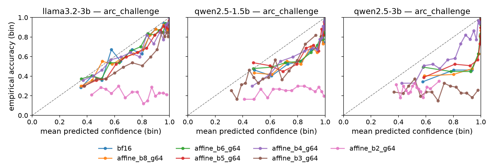
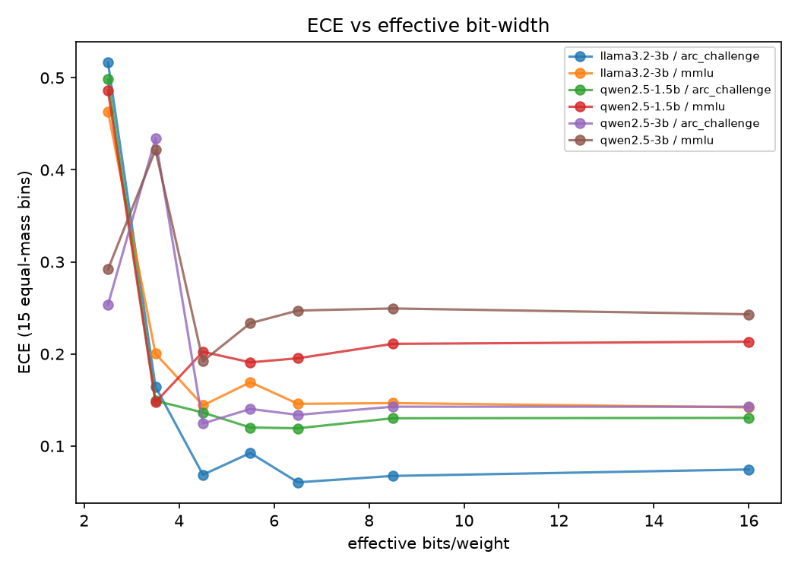
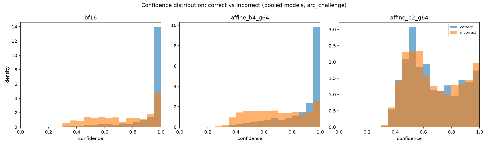

# The Calibration Cost of the MLX Quantization Ladder

**Author:** Mert Durukan
**Status:** results reported against the pre-registration frozen in [`PREREG.md`](PREREG.md).
**Repository:** this repository. Reproduction instructions in §8.

---

## Abstract

Post-training quantization is the default way compressed language models reach laptops and
phones, and the MLX/quantization literature that evaluates it reports throughput, latency, and
accuracy — never whether the compressed model's stated confidence still tracks its correctness.
We pre-registered four falsifiable hypotheses about how MLX's affine, `mxfp4`, and mixed-bit
quantization modes affect **probabilistic calibration** (ECE, calibration slope/intercept,
Brier score) on three instruction-tuned models (Qwen2.5-1.5B, Qwen2.5-3B, Llama-3.2-3B) across
14 quantization conditions and two letter-based multiple-choice benchmarks (ARC-Challenge,
MMLU), 1000 items each, 114 cells total, every number carrying a paired-bootstrap 95%
interval. All four hypotheses are **falsified as stated**, but not uniformly or uninterestingly
so. Calibration error does not increase monotonically with compression: one model
(Qwen2.5-3B) shows a real, statistically significant non-monotonic spike at 3-bit that
reverses at 2-bit (H1). Quantization does not shift confidence toward wrong answers in a
model-general way: Llama-3.2-3B mostly confirms the predicted direction, Qwen2.5-1.5B mostly
contradicts it, and Qwen2.5-3B contradicts it in every evaluated cell (H2). At matched 4-bit /
group-32, `affine` and `mxfp4` produce statistically indistinguishable calibration in five of
six model×benchmark cells (H3). Mixed-bit recipes mostly interpolate between their component
bit-widths' calibration, with one exception that beats both components (H4). The overall
picture is that quantization's calibration cost is real, large at low bit-widths, and
model-specific — not a single curve that generalizes across architectures.

---

## 1. Introduction

Compressed language models are the ones people actually run. A model that only exists at
16-bit precision on a datacenter GPU is, for most on-device and consumer use, not the model
that ships — the 4-bit or 2-bit quantized version is. The MLX/quantization literature that
evaluates these compressed models is throughput- and accuracy-first: it reports tokens/second,
memory footprint, and benchmark accuracy retained relative to the full-precision source
(§2.3). None of it asks whether the compressed model still *knows* when it is right.

That question is what probabilistic calibration measures: the agreement between a model's
stated confidence and its empirical correctness rate. A model can lose no accuracy under
compression and still become a worse citizen of any system that thresholds on its confidence —
an abstention policy, a human-in-the-loop escalation rule, a routing decision between a small
and a large model — if compression quietly makes the model's confidence less informative or
systematically inflated. That failure mode is invisible to every metric the quantization
literature currently reports.

The LLM-calibration literature, conversely, is large and has repeatedly found current models
poorly calibrated for reasons that have nothing to do with quantization: reinforcement
learning from human feedback biases models toward high verbalized confidence regardless of
response quality (§2.1), LLM judges overstate their own correctness, and calibration degrades
sharply outside English. Almost none of it varies the quantization axis (with one partial
exception discussed honestly in §2.2, since it complicates a clean "nobody has looked at this"
claim).

This paper reports a pre-registered, falsification-oriented study of that gap, specific to
MLX on Apple Silicon — the one deployment target where CUDA-only quantization toolchains
(GPTQ, AWQ, bitsandbytes) simply do not run, and where the accuracy-only evaluation habit of
the MLX ecosystem is least likely to be corrected by borrowing results from elsewhere. Four
hypotheses (RQ1–RQ4 in [`PREREG.md`](PREREG.md) §2) were frozen before any calibration number
was computed. All four are falsified as literally stated; §5 argues that the *way* each one
fails is itself the finding.

---

## 2. Related work

### 2.1 LLM calibration is broken for reasons unrelated to quantization

Reinforcement learning from human feedback is a documented source of overconfidence
independent of anything happening to model weights post-training. Leng et al. (2024) find that
reward models used in PPO training are biased toward high-confidence outputs regardless of
actual response quality, and that "RLHF tends to lead models to express verbalized
overconfidence in their own responses" (Leng et al., 2024, arXiv:2410.09724). Whether this
translates into poorly calibrated *conditional* token probabilities — the confidence signal
this study uses, see §3 — versus poorly calibrated *verbalized* confidence is not the same
question: K. Tian et al. (2023) report that "verbalized confidences emitted as output tokens
are typically better-calibrated than the model's conditional probabilities" for RLHF-tuned
models on several QA benchmarks (K. Tian et al., 2023, arXiv:2305.14975), which is the reason
this study's protocol deliberately measures option-token log-probabilities rather than a
model-verbalized number (PREREG §4.4) — the two are known to diverge and conflating them would
be a protocol confound, not a calibration finding.

Overconfidence has also been documented specifically in LLM-as-judge settings, where "predicted
confidence significantly overstates actual correctness" (Z. Tian et al., 2025,
arXiv:2508.06225), and across languages, where a large-scale study across six model families
and over 100 languages found that "non-English languages suffer from systematically worse
calibration" (Zhou et al., 2025, arXiv:2510.03136). Neither line of work varies model
compression; both are
cited here to establish that calibration failure in LLMs is a well-populated research area with
multiple independent causes already known — RLHF, evaluator role, language — to which this
study adds a fourth candidate cause that, unlike the other three, has not been measured with a
falsification-oriented protocol: quantization.

### 2.2 The closest prior work, read in full and disclosed honestly

One paper does sit inside the nominal intersection of "quantization" and "confidence
calibration metrics," and it would be dishonest to write this related-work section as if it
did not exist. Proskurina et al. (NAACL 2024 Findings) quantize Mistral-7B, Llama-7B, and a
560M model to 4-bit with GPTQ and evaluate confidence using Expected Calibration Error and
Adaptive Calibration Error across six benchmarks (ArcEasy, BoolQ, HellaSwag, OpenBookQA, PiQA,
XStory); they find quantization "results in a decrease in confidence regarding true labels" and
that it "disproportionately affects samples where the full model exhibited low confidence
levels" (Proskurina et al., 2024, arXiv:2405.00632). This is real, ECE-based,
quantization-and-calibration work, and PREREG §1's framing of the intersection as flatly
"empty" is, read against this paper, too strong as a literal claim — recorded as an open
finding during this write-up (`YAPILACAKLAR.md`, 2026-07-26) rather than silently corrected,
since `PREREG.md` itself is frozen and not edited post-hoc.

What Proskurina et al. do not do is what this study is specifically about: they report one
compression level (4-bit) with one algorithm (GPTQ) on CUDA hardware, not a bit-width ladder
from 8 down to 2 bits; they do not compare quantization *modes* at matched bit-width and group
size; they have no mixed-bit-recipe analogue to H4; three of their six benchmarks (HellaSwag,
PIQA, and XStory — the last a version of the two-ending StoryCloze continuation task) use
continuation-style scoring, which PREREG §4.3 excludes here specifically because it is a different, non-comparable
measurement protocol from letter-based multiple choice; and none of it runs on MLX, the
runtime this study is scoped to because it is the one CUDA-only toolchains cannot reach. The
gap this paper fills is narrower and more specific than "nobody has ever quantized a model and
measured its confidence" — it is: nobody has measured a full bit-width ladder, a matched-group
mode contrast, and mixed-bit recipes, with pre-registered falsification criteria, on the
runtime that actually runs on the hardware most compressed models are deployed to.

### 2.3 The MLX/quantization literature measures throughput and accuracy, not calibration

Recent systematic evaluations of LLM inference on Apple Silicon are thorough on performance and
silent on calibration. A comparative study of five local runtimes (MLX, MLC-LLM, llama.cpp,
Ollama, PyTorch MPS) measures time-to-first-token, steady-state throughput, latency percentiles,
long-context behavior, quantization support, streaming performance, batching/concurrency
behavior, and deployment complexity — and reports that "Apple Silicon inference
frameworks still trail NVIDIA GPU-based systems such as vLLM in absolute performance" (Rajesh
et al., 2025, arXiv:2511.05502) — a representative sample of what this ecosystem's benchmarking
culture optimizes for. Neither ECE, calibration slope/intercept, nor any other proper scoring
rule appears in that evaluation, and none of the throughput-oriented MLX benchmarking work
surveyed for this study's pre-registration reported one either (PREREG §1). That absence, not
the total absence of any quantization-confidence work anywhere (§2.2), is the specific gap this
study targets.

---

## 3. Method

Full design detail, frozen before any calibration number was computed, is in
[`PREREG.md`](PREREG.md); this section summarizes it.

**Models.** Four candidate bf16 sources (Qwen2.5-1.5B/3B-Instruct, Llama-3.2-1B/3B-Instruct),
gated into the main grid by a pre-specified, bf16-only eligibility rule (≥50% accuracy on at
least one benchmark, evaluated *before* any quantized cell runs — PREREG §4.2). Three models
cleared the gate (`qwen2.5-1.5b`, `qwen2.5-3b`, `llama3.2-3b`); `llama3.2-1b` did not
(arc=0.475, mmlu=0.435) and is bf16-only in the data. `Qwen2.5-0.5B` is a documented **floor
control**, run through the full ladder but reported separately (Table 5), not as a fifth main
model, to evidence that calibration is not meaningfully measurable near chance accuracy.

**Conditions (14 per eligible model).** bf16 reference; affine 8/6/5/4/3/2-bit at group size
64; affine 4-bit at group sizes 32 and 128 (matched-group controls); `mxfp4` 4-bit at group 32
(the only group size `mxfp4` accepts); four mixed-bit recipes (`mixed_2_6`, `mixed_3_4`,
`mixed_3_6`, `mixed_4_6`). All conditions are produced from a single bf16 source per model by
this repository's own conversion pipeline, so no vendor-side variation between published
checkpoints can act as a confound. Effective bits/weight is parsed from the conversion log for
every cell, not assumed from the nominal label (nominal 4-bit costs 4.501–4.502 bits/weight in
practice).

**Benchmarks.** ARC-Challenge and MMLU, 1000 items each, both scored as letter-based multiple
choice under one frozen prompt template. Confidence is the softmax over the option-letter
token log-probabilities (` A`, ` B`, ...) at the final position — not verbalized confidence,
for the reason given in §2.1. The first 20 items of every cell are warm-up and discarded, never
scored (MLX's lazy weight loading and first-use Metal kernel compilation make unwarmed timing
and, more subtly, unwarmed numerics unrepresentative of steady state).

**Metrics.** ECE (15 equal-mass bins, not equal-width), calibration slope and intercept
(logistic regression of correctness on logit-confidence, intercept via `statsmodels` GLM with
`offset=`), Brier score, mean confidence on correct vs. incorrect predictions, and
overconfidence rate (fraction of >90%-confidence predictions that are wrong). Every number
carries a 95% percentile bootstrap interval over items (2000 resamples, fixed seed); primary
contrasts are paired within item, differencing per item before summarizing, matching bf16 and
its quantized condition on the identical question set.

**Grid.** 114/114 cells completed with `status="ok"`; no cell was skipped, dropped, or silently
retried (PROTOKOL Kural 11; SPEC §0). One deployment-relevant correctness bug was caught and
fixed mid-run: Llama's tokenizer prepends an automatic BOS token that an off-by-one in the
option-token lookup was reading instead of the option letter itself, collapsing all four
options to identical logits. It was caught live (identical accuracy across two differently
sized Llama models is not plausible), fixed with a test-first, mutation-proven change
(`tests/test_measure.py`), and the four affected bf16 cells were re-measured before any
Llama quantized cell ran — full account in `GECMIS.md` ("Görev 9"). This does not affect Qwen,
whose tokenizer does not prepend BOS.

---

## 4. Results

### 4.1 H1 — Monotone degradation

*Falsifiable as stated: ECE increases monotonically as bit-width decreases from 8 to 2 bits,
with 95%-interval-confirmed reversals counting as violations.* **Falsified for 2 of 6
model×benchmark cells** (`qwen2.5-3b` on both benchmarks); holds for the other 4.

| bits | qwen2.5-1.5b/arc | qwen2.5-1.5b/mmlu | qwen2.5-3b/arc | qwen2.5-3b/mmlu | llama3.2-3b/arc | llama3.2-3b/mmlu |
|---|---|---|---|---|---|---|
| 16 (bf16) | 0.131 [0.111, 0.156] | 0.213 [0.186, 0.241] | 0.143 [0.121, 0.164] | 0.243 [0.217, 0.271] | 0.074 [0.053, 0.096] | 0.142 [0.121, 0.172] |
| 8 | 0.130 [0.108, 0.154] | 0.211 [0.185, 0.240] | 0.143 [0.122, 0.165] | 0.249 [0.223, 0.277] | 0.067 [0.051, 0.095] | 0.147 [0.123, 0.174] |
| 6 | 0.119 [0.101, 0.146] | 0.195 [0.172, 0.226] | 0.134 [0.113, 0.157] | 0.247 [0.220, 0.276] | 0.061 [0.048, 0.090] | 0.146 [0.123, 0.176] |
| 5 | 0.120 [0.097, 0.142] | 0.191 [0.167, 0.220] | 0.140 [0.118, 0.162] | 0.233 [0.207, 0.262] | 0.092 [0.072, 0.117] | 0.169 [0.144, 0.197] |
| 4 | 0.136 [0.112, 0.160] | 0.202 [0.174, 0.231] | 0.124 [0.099, 0.151] | 0.192 [0.166, 0.220] | 0.069 [0.058, 0.103] | 0.144 [0.122, 0.175] |
| 3 | 0.149 [0.125, 0.179] | 0.148 [0.127, 0.180] | **0.434 [0.404, 0.463]** | **0.422 [0.392, 0.450]** | 0.165 [0.137, 0.193] | 0.200 [0.177, 0.233] |
| 2 | 0.498 [0.469, 0.527] | 0.486 [0.456, 0.514] | 0.254 [0.226, 0.281] | 0.292 [0.265, 0.321] | 0.517 [0.488, 0.545] | 0.463 [0.435, 0.491] |

*Table 1 — ECE (point [95% CI]) across the affine bit-width ladder, one column per eligible
model×benchmark. Bold marks the confirmed non-monotone reversal.*

`qwen2.5-3b`'s 3-bit cell is a genuine, statistically significant spike — ECE nearly doubles
relative to its own 4-bit neighbor and its own 2-bit neighbor on *both* benchmarks, with
non-overlapping 95% intervals in both directions. This is not bootstrap noise: it is the same
model, the same items, one bit-width worse in the middle of the ladder, and then *better*
again one step further down. Every other reversal in the table (e.g. `llama3.2-3b`'s ECE
dipping slightly at 6-bit relative to 8-bit) has overlapping intervals and is correctly not
flagged as a violation by the pre-registered decision rule (PREREG §3 H1: "with 95% intervals
excluding the reversal being noise").





### 4.2 H2 — Directional overconfidence

*Falsifiable as stated: quantization moves the calibration intercept negative and raises mean
confidence on incorrect predictions, relative to bf16, for the population of quantized
conditions.* **Falsified: 13 confirming cells vs. 36 contradicting cells**, out of 78 non-bf16
(model, benchmark, condition) triples (3 models × 2 benchmarks × 13 non-bf16 conditions); the
remaining 29 are inconclusive — the 95% interval spans zero on at least one of the two required
components (`results/tables/verdicts.json`).

The direction is not model-general. `llama3.2-3b` supplies 10 of the 13 confirming cells and
only 2 of the 36 contradicting ones — for this model the predicted mechanism (confidence rises
on wrong answers as bits fall) mostly holds. `qwen2.5-1.5b` supplies 16 of the 36 contradicting
cells and only 3 confirming ones. `qwen2.5-3b` supplies **zero** confirming cells and 18 of the
36 contradicting ones — more than half its non-bf16 cells moved in the *opposite* direction
from H2's prediction, and by a large margin:

| model | benchmark | condition | Δ intercept (95% CI) | Δ conf(incorrect) (95% CI) |
|---|---|---|---|---|
| qwen2.5-1.5b | arc_challenge | affine_b4_g64 | 0.214 [0.006, 0.417] | -0.027 [-0.053, -0.001] |
| qwen2.5-1.5b | arc_challenge | affine_b2_g64 | -1.465 [-1.832, -1.087] | -0.042 [-0.068, -0.016] |
| qwen2.5-1.5b | mmlu | affine_b4_g64 | 0.198 [0.009, 0.381] | -0.035 [-0.053, -0.016] |
| qwen2.5-1.5b | mmlu | affine_b2_g64 | -1.394 [-1.716, -1.058] | 0.057 [0.034, 0.079] |
| qwen2.5-3b | arc_challenge | affine_b4_g64 | 2.357 [1.924, 2.819] | -0.160 [-0.189, -0.132] |
| qwen2.5-3b | arc_challenge | affine_b2_g64 | 2.097 [1.623, 2.564] | -0.328 [-0.353, -0.302] |
| qwen2.5-3b | mmlu | affine_b4_g64 | 1.548 [1.238, 1.883] | -0.156 [-0.179, -0.133] |
| qwen2.5-3b | mmlu | affine_b2_g64 | 1.483 [1.119, 1.847] | -0.273 [-0.294, -0.251] |
| llama3.2-3b | arc_challenge | affine_b4_g64 | -0.038 [-0.182, 0.105] | 0.020 [0.000, 0.040] |
| llama3.2-3b | arc_challenge | affine_b2_g64 | -2.450 [-2.725, -2.175] | 0.126 [0.099, 0.153] |
| llama3.2-3b | mmlu | affine_b4_g64 | 0.031 [-0.119, 0.191] | -0.007 [-0.025, 0.009] |
| llama3.2-3b | mmlu | affine_b2_g64 | -1.610 [-1.870, -1.348] | 0.099 [0.077, 0.120] |

*Table 2 — representative conditions (4-bit and 2-bit, group 64) per model×benchmark; the
paired-bootstrap deltas for all 13 non-bf16 conditions × 3 models × 2 benchmarks are in
`results/tables/table2_h2_confidence_direction.csv`. H2 requires both columns to move
significantly in the predicted direction (intercept down, conf-on-incorrect up) for a cell to
confirm.*

`qwen2.5-3b`'s intercept moves sharply *positive* (better-calibrated intercept, if intercept
were read alone) while its confidence-on-incorrect-answers moves down — the opposite pairing
from what H2 predicts, and opposite to what a naive "quantization = overconfidence" story
would suggest. Two components of the same nominal phenomenon (intercept shift, confidence
misallocation) decoupling and pointing in different directions for different model families is
itself evidence against a single, portable "quantization causes overconfidence" mechanism.

### 4.3 H3 — Mode contrast at matched bits/group

*Falsifiable as stated: `affine` and `mxfp4` produce different ECE at 4-bit/group-32, falsified
only if every model×benchmark cell's 95% intervals overlap.* **Not falsified — but only just.**

| model | benchmark | affine ECE (95% CI) | mxfp4 ECE (95% CI) | differs |
|---|---|---|---|---|
| llama3.2-3b | arc_challenge | 0.096 [0.077, 0.125] | 0.097 [0.077, 0.124] | no |
| llama3.2-3b | mmlu | 0.168 [0.141, 0.197] | 0.186 [0.159, 0.216] | no |
| qwen2.5-1.5b | arc_challenge | 0.155 [0.130, 0.179] | 0.179 [0.153, 0.206] | no |
| qwen2.5-1.5b | mmlu | 0.215 [0.187, 0.244] | 0.282 [0.253, 0.313] | **yes** |
| qwen2.5-3b | arc_challenge | 0.140 [0.118, 0.162] | 0.152 [0.130, 0.176] | no |
| qwen2.5-3b | mmlu | 0.269 [0.240, 0.297] | 0.242 [0.213, 0.270] | no |

*Table 3 — full H3 table. `differs` = 95% CIs do not overlap.*

Five of six cells overlap. `qwen2.5-1.5b`/MMLU is the sole exception (`mxfp4` visibly worse:
0.282 vs. 0.215), which is enough under the pre-registered "falsified only if *all* cells
overlap" rule to keep H3 alive, but the practical reading is closer to "mode mostly does not
matter at matched bits/group, with one model×benchmark exception" than to a general claim that
`mxfp4` and `affine` diverge in calibration.

### 4.4 H4 (secondary) — Mixed-bit interpolation

*Falsifiable as stated: each `mixed_a_b` recipe's ECE lies between its component uniform
`a`-bit and `b`-bit conditions' ECE point estimates, with a 95% interval.* **Falsified in 1 of
24 recipe×model×benchmark cells.**

| model | benchmark | recipe | recipe ECE (95% CI) | component range [a,b] ECE points | within range |
|---|---|---|---|---|---|
| llama3.2-3b | arc_challenge | mixed_2_6 | 0.389 [0.360, 0.417] | [0.061, 0.517] | yes |
| llama3.2-3b | arc_challenge | mixed_3_4 | 0.121 [0.102, 0.151] | [0.069, 0.165] | yes |
| llama3.2-3b | arc_challenge | mixed_3_6 | 0.102 [0.082, 0.129] | [0.061, 0.165] | yes |
| llama3.2-3b | arc_challenge | mixed_4_6 | 0.059 [0.047, 0.090] | [0.061, 0.069] | yes |
| llama3.2-3b | mmlu | mixed_2_6 | 0.387 [0.356, 0.416] | [0.146, 0.463] | yes |
| llama3.2-3b | mmlu | mixed_3_4 | 0.165 [0.143, 0.196] | [0.144, 0.200] | yes |
| llama3.2-3b | mmlu | mixed_3_6 | 0.164 [0.138, 0.193] | [0.146, 0.200] | yes |
| llama3.2-3b | mmlu | mixed_4_6 | 0.139 [0.117, 0.168] | [0.144, 0.146] | yes |
| qwen2.5-1.5b | arc_challenge | mixed_2_6 | 0.457 [0.426, 0.485] | [0.119, 0.498] | yes |
| qwen2.5-1.5b | arc_challenge | mixed_3_4 | 0.157 [0.133, 0.189] | [0.136, 0.149] | yes |
| qwen2.5-1.5b | arc_challenge | mixed_3_6 | 0.074 [0.059, 0.107] | [0.119, 0.149] | **no** |
| qwen2.5-1.5b | arc_challenge | mixed_4_6 | 0.132 [0.108, 0.156] | [0.119, 0.136] | yes |
| qwen2.5-1.5b | mmlu | mixed_2_6 | 0.483 [0.454, 0.511] | [0.195, 0.486] | yes |
| qwen2.5-1.5b | mmlu | mixed_3_4 | 0.160 [0.137, 0.191] | [0.148, 0.202] | yes |
| qwen2.5-1.5b | mmlu | mixed_3_6 | 0.128 [0.107, 0.160] | [0.148, 0.195] | yes |
| qwen2.5-1.5b | mmlu | mixed_4_6 | 0.204 [0.177, 0.233] | [0.195, 0.202] | yes |
| qwen2.5-3b | arc_challenge | mixed_2_6 | 0.233 [0.207, 0.262] | [0.134, 0.254] | yes |
| qwen2.5-3b | arc_challenge | mixed_3_4 | 0.394 [0.365, 0.424] | [0.124, 0.434] | yes |
| qwen2.5-3b | arc_challenge | mixed_3_6 | 0.456 [0.428, 0.484] | [0.134, 0.434] | yes |
| qwen2.5-3b | arc_challenge | mixed_4_6 | 0.125 [0.103, 0.148] | [0.124, 0.134] | yes |
| qwen2.5-3b | mmlu | mixed_2_6 | 0.245 [0.220, 0.273] | [0.247, 0.292] | yes |
| qwen2.5-3b | mmlu | mixed_3_4 | 0.363 [0.335, 0.393] | [0.192, 0.422] | yes |
| qwen2.5-3b | mmlu | mixed_3_6 | 0.430 [0.400, 0.460] | [0.247, 0.422] | yes |
| qwen2.5-3b | mmlu | mixed_4_6 | 0.210 [0.183, 0.237] | [0.192, 0.247] | yes |

*Table 4 — full H4 table. The single falsified cell (`qwen2.5-1.5b`/arc_challenge/`mixed_3_6`)
beats both of its components rather than landing between them — a favorable, not adverse,
exception.*

Mixed-bit recipes interpolate almost exactly as their design intends. The one exception is a
recipe that is *better calibrated* than either uniform bit-width it mixes, on the same model
where H1 also showed the largest single-model instability at 3-bit (§4.1) — consistent with
that model's calibration surface being unusually non-smooth in the 3-to-6-bit region generally,
rather than a mixed-recipe-specific effect.

### 4.5 Floor control and confidence-distribution shift

`Qwen2.5-0.5B`, excluded from the main grid at 33% pilot accuracy (near the 25%-chance floor
for four-option MC), was run through the identical 14-condition ladder and is reported
separately (PREREG §4.2). Accuracy stays near or below chance throughout the ladder
(ARC-Challenge: 0.518 at bf16 down to 0.240 at 2-bit; ARC's `mixed_2_6` cell reaches 0.250,
literal chance) and ECE is correspondingly close to uninformative — it moves within a
0.163–0.503 band that does not track any legible ladder trend, which is exactly the outcome
predicted qualitatively in PREREG §4.2: near chance accuracy, "ECE is dominated by the base
rate rather than by the quantization treatment." Full table:
`results/tables/table5_floor_control.csv`.

Separately, two of the extreme-compression cells in the *main* grid (`qwen2.5-3b`'s
`affine_b2_g64` and `mixed_2_6`, on both benchmarks) produced an unregistered but real
side-observation during analysis (`GECMIS.md`, "Görev 10"): no prediction in those cells
exceeded the 90% overconfidence threshold at all (`overconfidence_rate` is undefined, 0/0, not
zero) — the model became *underconfident* at that compression level, not overconfident. This is
visible in Figure 3 as a rightward-collapsed confidence distribution rather than a
leftward-shifted one, and is reported as a transparency column
(`overconfidence_rate_n_qualifying`), not folded into any H1–H4 verdict, per PREREG §5's rule
that anything outside the four pre-registered tables is exploratory.



---

## 5. Discussion

Every hypothesis in this pre-registration is falsified as literally stated, and the
falsification pattern is the finding. H1's monotonicity fails in a way that is model-specific
and localized (one model, the 3-to-2-bit boundary) rather than general — a practitioner reading
"ECE roughly holds through 4-bit, then worsens" off `qwen2.5-1.5b` or `llama3.2-3b` alone would
build a false mental model of `qwen2.5-3b`'s actual behavior. H2's directional claim fails even
harder: not only is there no universal direction, the three models in the main grid split into
"mostly confirms," "mostly contradicts," and "always contradicts, and by a wide margin"
categories, with `qwen2.5-3b`'s intercept and confidence-on-incorrect components moving in
*decoupled* directions relative to each other. H3 survives only because one cell out of six
carries it, which is a thin margin for a claim about "mode." H4 is the closest thing to a clean
result — recipes interpolate almost everywhere — and its one exception is favorable, not
adverse.

The practical reading for someone deciding whether to ship a quantized model: **do not
transfer a calibration verdict from one model family to another, and do not assume a
mid-ladder bit-width is calibration-safe because a neighboring bit-width is.** The single most
actionable number in this dataset may be `qwen2.5-3b`'s 3-bit ECE spike (Table 1) — a
practitioner benchmarking only 4-bit and 2-bit, the two most commonly shipped quantization
levels, would never see it, and would conclude the ladder is smooth when it is not.

Section 2.2's disclosure matters for how this result should be read against prior literature:
Proskurina et al. (2024) already showed that 4-bit GPTQ quantization degrades LLM confidence on GPU
hardware. This study's contribution is not "quantization affects confidence" — that was known
— but the shape of the effect across a full bit-width ladder, its dependence on quantization
mode and group size, its (non-)interpolation across mixed-bit recipes, and its presence on the
one runtime (MLX) that the compression literature covering it has not evaluated calibration on
at all.

---

## 6. Limitations

Stated in advance in PREREG §6 and reproduced here for the paper itself:

- **Letter-based multiple choice only.** No claim about free-generation confidence,
  continuation scoring (HellaSwag/PIQA-style), or verbalized uncertainty — §2.1 gives a
  specific reason those are a different, non-comparable measurement.
- **Models ≤ 3B parameters.** No claim about 7B+ or frontier-scale behavior; §2.2's closest
  prior work touches 7B on different hardware, which this study does not directly compare
  against numerically (different toolchain, different benchmark protocol).
- **MLX on Apple Silicon (M4 Pro) only.** No claim about GPTQ, AWQ, GGUF, or CUDA runtimes.
- **Post-hoc recalibration is out of scope.** Temperature scaling and similar corrections are
  a natural follow-up, not attempted here.
- **English-language benchmarks only** — §2.1's multilingual-calibration finding suggests this
  study's picture could look different, possibly worse, in non-English settings; untested.
- **Three eligible main models.** The pre-registered eligibility gate is mechanical and applied
  before any quantized result is seen (PREREG §4.2), which protects against post-hoc model
  cherry-picking, but it also means the "model-specific" claim in §5 rests on three data points,
  not a large model population — `llama3.2-3b`, `qwen2.5-1.5b`, and `qwen2.5-3b` disagreeing
  with each other on H2's direction is suggestive, not a population-level generalization.

## 7. Deviations from the pre-registration

None. `DEVIATIONS.md` is empty at the time of this write-up — no design element (conditions,
benchmarks, protocol, metrics, eligibility rule) was changed after `PREREG.md` was frozen. The
one bug found and fixed mid-run (§3, Llama BOS-token misread) was a measurement-code
correction, not a design deviation: it was caught, fixed, and re-run entirely before any
affected cell's quantized results were observed, and it changed which model cleared the
eligibility gate (`llama3.2-3b` moved from excluded to eligible) rather than any hypothesis's
falsification criterion.

## 8. Reproducibility

```bash
git clone <this repo>
cd mlx-quantization-calibration
make setup
make reproduce   # make test -> python -m src.runner -> python -m src.analyze
```

Requires Apple Silicon (MLX has no CUDA path). Environment: Python 3.14, `mlx-lm==0.31.3`,
`mlx==0.32.0`, pinned in `requirements.lock.txt`; measured on an Apple M4 Pro, 24GB unified
memory. The grid is resumable — a cell already written to `results/cells/` is skipped, so an
interrupted run restarts with the same command (verified by deliberate interruption during the
actual run, `GECMIS.md` "Görev 9"). Every reported number in this paper is recomputed by
`python -m src.analyze` from the per-item log-probabilities in `results/cells/*.parquet`;
nothing under `results/` is hand-edited (PROTOKOL Kural 11). `results/tables/verdicts.json`
carries every PASS/FAIL verdict and its full reasoning trail (confirming/contradicting/
differing/falsified cell lists) underlying §4's summaries.

---

## References

- Rajesh, V., Jodhpurkar, O., Anbuselvan, P., Singh, M., Jallepali, A., Godbole, S., Sharma,
  P. K., & Shrivastava, H. (2025). *Production-Grade Local LLM Inference on Apple Silicon: A
  Comparative Study of MLX, MLC-LLM, Ollama, llama.cpp, and PyTorch MPS.*
  [arXiv:2511.05502](https://arxiv.org/abs/2511.05502)
- Proskurina, I., Brun, L., Metzler, G., & Velcin, J. (2024). *When Quantization Affects
  Confidence of Large Language Models?* NAACL 2024 Findings.
  [arXiv:2405.00632](https://arxiv.org/abs/2405.00632)
- Leng, J., Huang, C., Zhu, B., & Huang, J. (2024). *Taming Overconfidence in LLMs: Reward
  Calibration in RLHF.* [arXiv:2410.09724](https://arxiv.org/abs/2410.09724)
- Tian, Z., Han, Z., Chen, Y., Xu, H., Yang, X., Xuan, R., Wang, H., & Liao, L. (2025).
  *Overconfidence in LLM-as-a-Judge: Diagnosis and Confidence-Driven Solution.*
  [arXiv:2508.06225](https://arxiv.org/abs/2508.06225)
- Tian, K., Mitchell, E., Zhou, A., Sharma, A., Rafailov, R., Yao, H., Finn, C., & Manning,
  C. D. (2023). *Just Ask for Calibration: Strategies for Eliciting Calibrated Confidence
  Scores from Language Models Fine-Tuned with Human Feedback.*
  [arXiv:2305.14975](https://arxiv.org/abs/2305.14975)
- Zhou, E., Zhang, C., Hu, T., Li, C., Collier, N., Vulić, I., & Korhonen, A. (2025). *Beyond
  the Final Layer: Intermediate Representations for Better Multilingual Calibration in Large
  Language Models.* [arXiv:2510.03136](https://arxiv.org/abs/2510.03136)

Internal: [`PREREG.md`](PREREG.md) (frozen design and hypotheses), [`SPEC.md`](SPEC.md)
(implementation contract), [`README.md`](README.md) (repository front page),
[`GECMIS.md`](GECMIS.md) (decision and incident log), `results/tables/verdicts.json` (full
mechanical verdict trail). Sibling study: `imbalance-calibration`
(`~/github-projects/imbalance-calibration`), the same "does the model know how honest it is"
question for class-imbalanced training rather than quantization.
